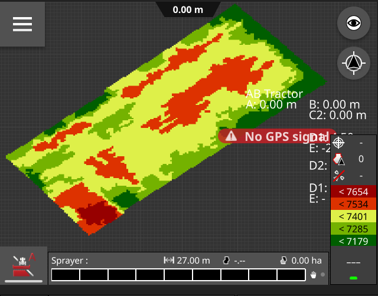

# Grids

## What is a grid?
A grid is used to describe Seeding, Fertilization or CropProtection maps. It is like a geo located chess boardw with setpoints for different areas of a field. It might e.g. say that at 52.1234&deg;N and 1.23345&deg;E, there shall be 40kg/ha of seed applied. 52.1235&deg;N and 1.23345&deg;E, 20kg/ha shall be seeded.

A grid is like a 2 or 3 dimensional array with dimension 1 being the latitude, dimension 2 being the longitude and potential dimension 3 (0 in the real array) being the layer. There might be multiple layers in a
grid, e.g. one for seeding and a second for fertilizing.



*A grid on a CCI1200*

## Where are grids found in ISOXML?

Grids are sub elements of a Task(TSK), mentioned as GRD. They require an external file with a naming convention "GRD00000.bin" and include a 2 or 3 dimensional array.

There are 2 types of Grids:
### Type 1
Type one is a 2 or 3 dimensional array of bytes. Each cell describes a value of a TreatmentZone. Grids of Type 1 can include up to 255 different amount values to be applied on the field

### Type 2
Type 2 is a 2 or 3 dimensional array of 32bit integers. It does not redirect to a TreatmentZone but directly includes the value to be applied to the field.


## Grids in ISOXML.Net

Each ISOXML Object has an Array of Grids. Those Grids are linked in the Grid-List of a Task in the ISOXML.Data Element. Even though each Task has a List of Grids, only one Grid should be used per Grid. (A task can only have one grid, the list is is actually a downside of the generation from XSD.)


### Creating a Grid 

The most simple way to generate a grid is the Function CreateGrid within the ISOTask Object (in isoxml.data.Task[]);

``` cs
var task = new ISOTask(){
    TaskDesignator = "Seeding"
}
task.CreateGrid(new ISOGrid()
    {
        Filename = gridName,
        GridCellEastSize = 0.0001,
        GridCellNorthSize = 0.0001,
        GridMaximumColumn = columns,
        GridMaximumRow = rows,
        GridType = ISOGridType.gridtype2,
        TreatmentZoneCode = 1
    },
    new[] {
        new ISOGridLayer(11, "DET-1")
    });
```

### Manipulating grids

To change the value at a specific point within a grid, use the function 

``` cs
 grid.SetValue(x,y,value,layer);

```
The Layer-Attribute is optional.

### Exporting Grids to CSV

A special function to debug Grids is the export to CSV.

``` cs
var isoGrid = new ISOGrid(){
    //Set Grid Parameters
    //...
};
var grid = ISOGridFile.Create(isoGrid);

//Fill Grid

grid.SaveCSV("C:/test/grid.csv");

``` 